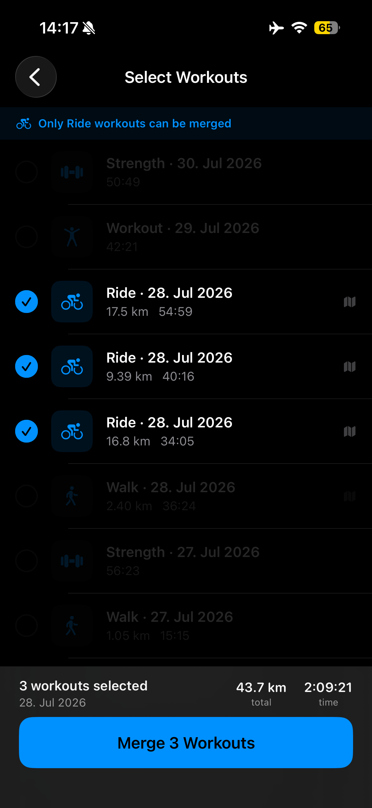

# weave2-site

Marketing site + privacy policy for the Weave iOS app. Plain HTML/CSS, no build step.

## Structure

- `index.html` — landing page (animated headline, screenshot strip, TestFlight beta signup, features, Pro)
- `privacy.html` — privacy policy (linked from the App Store listing and the beta form)
- `support.html` — support page (linked from the App Store listing)
- `share-workout-instagram.html` — guide: sharing an Apple Watch workout on Instagram (see [Guides](#guides))
- `merge-workouts.html` — guide: merging finished Apple Watch workouts into one Recap card
- `404.html` — "page not found" page in both languages; GitHub Pages serves it at any missing path, so its URLs are root-absolute
- `de/` — German copies of every page except `404.html`; the root redirects German browsers here (see `docs/adr/0001-german-under-de-path-with-root-redirect.md`). A copy change goes in both languages by hand.
- `styles.css` — shared styles
- `script.js` — headline word-cycle animation (visual only; the heading text keeps the first word) and the language-switch choice
- `assets/` — logo, favicon, screenshots (copied from `Weave 2/docs/marketing/`), resized for the web; the full-resolution originals live in `assets/source/` and no page references them (see [Images](#images))
- `CNAME` — custom domain for GitHub Pages (`workoutstories.app`)

## Guides

Guide pages answer a task people search for (e.g. "share Apple Watch workout on Instagram") and rank for it. Each one is useful without Weave: Apple's and Instagram's built-in ways first, then Weave's way. To add the next one:

1. **Pick a short, keyword-bearing slug** and use it for both languages (ADR 0001): `my-guide.html` at the root, `de/my-guide.html` for German.
2. **Copy an existing guide pair** (`share-workout-instagram.html` and its twin) and change, in the `<head>` of both: `<title>` (60 characters at most, with the target phrase), meta description, canonical, the three `hreflang` alternates (`x-default` is the English URL), `og:url`, and the `og:`/`twitter:` title and description (identical to the page's own). Point the language switch at the twin.
3. **Write the body** inside `<main class="doc guide">`: an `.eyebrow` ("Guide" / "Anleitung"), one `<h1>` with the target phrase, the updated date, a short intro, then one `<section>` per method with an `<h2>` and an ordered list of steps. Use the target phrase once more in a subheading. Quote app and system labels exactly as the UI shows them in that language — the app's in `Weave 2/Localizable.xcstrings`, Apple's and Instagram's from their German help pages. German copy is written for German readers (informal "du"), not translated sentence by sentence. State only what you have checked against Apple's or Instagram's help pages or the app's code, and link the help page you used.
4. **Images**: at most one or two existing screenshots, marked up as in [Images](#images). Any image after the opening tag of the page's first `<section>` (including one inside that first section) needs `loading="lazy" decoding="async"`, and any image before it must not have it; the check enforces both.
5. **Link it**: add both URLs to `sitemap.xml`, a link from the relevant feature card on both home pages, and a footer link on both home pages and on every guide.
6. Run `node scripts/check-site.mjs`; its twin, hreflang, sitemap, link and image checks pick up the new pages without any change to the script.

## Local preview

Serve the repo root over HTTP — internal links point at directories (`./`, `../`), which a `file://` preview cannot open:

```bash
python3 -m http.server 8000
open http://localhost:8000/
```

The 404 page is not served for missing paths locally; open `/404.html` to see it.

## Checks

Run before committing, from the repo root (Node 18+, no dependencies):

```bash
node scripts/check-site.mjs
```

It exits non-zero and prints `FAIL <page> [<check>] <reason>` for each problem. It checks that every local or same-domain `href`/`src`/`<meta content>` URL (including `#anchor` targets) resolves; every page has an English/German twin with a matching canonical and `og:url`, reciprocal `hreflang` alternates and a language switch that leads to the twin (with `?lang=en` when it leads to the redirecting root); `sitemap.xml` and the pages agree; both index pages have the same ids, `<section>`s and `.card` blocks; no internal link targets `index.html` (link to the directory instead); `404.html` is `noindex`, uses only root-absolute URLs and links to both home pages (it has no twin and must not be listed in `sitemap.xml`); and the root redirect script, run as-is against stubbed browsers, sends only German-first browsers to `de/` and respects `?lang=en` and a stored choice.

Structured data: each home page must carry exactly one JSON-LD block that parses, describes a `MobileApplication` (name, description, iOS, category, the page's own URL and language, publisher with email, no ratings), and prices every offer in the page's currency (USD on English, EUR on German), with the "Weave Pro" offer equal to the price shown in the Pro band. Change the visible price and the JSON-LD together.

FAQ: both home pages must have a visible `#faq` section (one `.faq-item` per question: an `<h3>` question, then `<p>` answer) with 5 to 7 questions, a `FAQPage` node in that same JSON-LD block with the same questions and answers in the same order, and the same number of questions in English and German. Edit the visible text and the JSON-LD together. The two are compared as the text a reader sees: inline markup (`<strong>Metric</strong>: distance`) and entities (`&rsquo;`) count as the characters they show, so the JSON-LD holds the same words without the tags.

Titles: each home page's `<title>` must name Weave, "app" and workouts within 60 characters, at least one `<h1>`–`<h3>` must do the same, and `og:`/`twitter:` titles and descriptions must equal the page's own title and meta description.

It also checks images: every `` declares a `width` and `height` equal to its file's pixels (and every `<source>` in its `<picture>` has the same shape); no image a page references (including `<source srcset>` and the favicon) is over 150 KB; the images a current browser fetches on first load (the first `<source>` of each `<picture>`, lazy images excluded) add up to at most 400 KB per page; images before a page's first `<section>` (nav, hero, screenshot strip) load eagerly and every image after it has `loading="lazy"`; and nothing references `assets/source/`. Share images (`og:image`) and `apple-touch-icon` are not fetched by visitors and are exempt from the budgets.

Each home page has exactly one `<h1>`, and it carries the rotating word (`.word-track`). The check also reads each `<h1>`'s text: as a crawler reads the markup and as a screen reader gets it (with `aria-hidden` parts dropped and CSS-drawn `data-word` text included), the two must be the same sentence, with no words run together (`runs.Share`). A heading with a rotating word (`.word-track`) must contain the first word exactly once and none of the others. The rotating words live in `data-word` attributes inside the `aria-hidden` viewport, are drawn by `::before { content: attr(data-word) }`, and the `.sr-only` word stays the first word; `script.js` only moves the track.


## Images

Screenshots ship at 600 px wide (twice the ~300 px they are shown at) as WebP, with an indexed-colour PNG as fallback for browsers without WebP, through a `<picture>` element. The logo ships at 192 px (shown at 96 px and 30 px). The full-resolution originals (1179×2556 screenshots, the 1024 px logo) are kept in `assets/source/`, mirroring the paths under `assets/`; pages never reference them.

There is no build step. After adding or replacing an original, regenerate the web copies once from the repo root and commit them (needs `cwebp` and `ffmpeg`, e.g. `brew install webp ffmpeg`; `sips` ships with macOS):

```bash
for src in assets/source/screenshots/screen-*.png assets/source/screenshots/de/screen-*.png; do
  out="assets/${src#assets/source/}"
  cwebp -quiet -q 80 -m 6 -resize 600 0 "$src" -o "${out%.png}.webp"
  ffmpeg -loglevel error -y -i "$src" -vf "scale=600:-1:flags=lanczos,split[a][b];[a]palettegen=max_colors=256:stats_mode=full[p];[b][p]paletteuse=dither=sierra2_4a" "$out"
done
sips --resampleWidth 192 assets/source/logo.png --out assets/logo.png
```

The PNG fallback is reduced to 256 colours because a full-colour 600 px PNG is 160–340 KB, over the per-image budget. Mark up a new screenshot like the existing ones:

```html
<picture>
  <source srcset="assets/screenshots/screen-1.webp" type="image/webp">
  
</picture>
```

Add `loading="lazy" decoding="async"` to the `` when it sits below the first screen (after the page's first `<section>`). Screenshots on the first screen carry `fetchpriority="low"` instead: the home pages' largest paint is the headline text, and Lighthouse's simulated LCP counts every image fetched at medium or high priority before that paint against it (that is what made the English page's LCP 10 s). The logo, the only first-screen image that is part of the hero itself, keeps its normal priority and ships as a 4 KB WebP on the home pages (`assets/logo.webp`, `cwebp -q 85 -m 6 -resize 192 0 assets/source/logo.png -o assets/logo.webp`). `node scripts/check-site.mjs` enforces the dimensions, budgets and lazy loading.

## Status

Live at `https://workoutstories.app` via GitHub Pages, HTTPS enforced (Let's Encrypt certificate issued and renewed by GitHub). DNS at Namecheap: four `A` and four `AAAA` records on `@` for GitHub Pages, `www` a `CNAME` to `hoelzlm.github.io`. Moved from `weave.rinnebuehl.de` on 2026-09-30; that host is a Namecheap URL redirect (301, HTTP only) to the home page, so old deep links land on `/`. Beta signup form posts to Formspree (`mppazblp`).

## Outlook — what's next

- **Swap the TestFlight CTA for the real App Store link** once the listing is live: replace the `#beta` hero button and retire the beta-signup section (or repurpose it as a "you're in" confirmation) in `index.html` and drop the matching paragraph in `privacy.html`.
- **Verify the Formspree flow end-to-end**: submit a real address on the production site and confirm the notification arrives at the configured destination before pointing any traffic at the beta.

## SEO

- `robots.txt` and `sitemap.xml` at the repo root — every English and German page (home pages, privacy, support, guides) except `404.html`, `Allow: /`, no `lastmod` (goes stale, not worth tracking).
- Open Graph / Twitter Card meta tags on every page, reusing each page's existing `<title>`/`<meta description>`. Share image is `assets/og-image.png` (1200×630, logo centered on the site's gradient) — regenerate by rendering `og-render.html`-style markup through headless Chrome if the logo or gradient ever changes.
- Canonical URL tag and reciprocal `hreflang` alternates on every page.

### Measuring

Lighthouse (mobile) on both live home pages, before and after SEO work. Needs Node and Chrome; not part of `check-site.mjs`, because it depends on the network.

```bash
for page in "" de/; do
  npx -y lighthouse@12 "https://workoutstories.app/$page" --quiet --form-factor=mobile \
    --only-categories=performance,accessibility,best-practices,seo \
    --chrome-flags="--headless=new --lang=en-US" --output=json --output-path="lh-${page:-en}.json"
done
```

| Date | Page | Perf | A11y | Best pr. | SEO | LCP | CLS | Weight |
|---|---|---|---|---|---|---|---|---|
| 2026-09-30 (baseline) | `/` | 72 | 95 | 100 | 100 | 10.0 s | 0.02 | 1,858 KiB |
| 2026-09-30 (baseline) | `/de/` | 99 | 95 | 100 | 100 | 0.9 s | 0.083 | 2,816 KiB |
| 2026-10-01 (local, before ticket 04) | `/` | 75 | 95 | 100 | 100 | 10.5 s | 0 | 1,870 KiB |
| 2026-10-01 (local, before ticket 04) | `/de/` | 75 | 95 | 100 | 100 | 15.2 s | 0.001 | 2,828 KiB |
| 2026-10-01 (local, lighter images) | `/` | 100 | 95 | 100 | 100 | 1.9 s | 0 | 170 KiB |
| 2026-10-01 (local, lighter images) | `/de/` | 100 | 95 | 100 | 100 | 1.9 s | 0 | 173 KiB |
| 2026-10-01 (local, LCP fix) | `/` | 100 | 100 | 100 | 100 | 1.0 s | 0 | 139 KiB |
| 2026-10-01 (local, LCP fix) | `/de/` | 100 | 100 | 100 | 100 | 1.0 s | 0 | 141 KiB |
| 2026-10-01 (local, tester, live pending) | `/?lang=en` | 100 | 100 | — | 100 | 1.3 s | 0 | 147 KiB |
| 2026-10-01 (local, tester, live pending) | `/de/` | 100 | 100 | — | 100 | 1.2 s | 0 | 151 KiB |
| 2026-10-01 (local, tester, live pending) | `/share-workout-instagram.html` | 100 | 100 | — | 100 | 1.4 s | 0 | 76 KiB |
| 2026-10-01 (local, tester, live pending) | `/de/merge-workouts.html` | 100 | 100 | — | 100 | 1.3 s | 0 | 90 KiB |
| 2026-10-01 (live, median of 3) | `/` | 100 | 100 | 100 | 100 | 1.3 s | 0 | 126 KiB |
| 2026-10-01 (live, median of 3) | `/de/` | 100 | 100 | 100 | 100 | 1.1 s | 0 | 130 KiB |
| 2026-10-01 (live, median of 3) | `/share-workout-instagram.html` | 100 | 100 | 100 | 100 | 1.1 s | 0 | 62 KiB |
| 2026-10-01 (live, median of 3) | `/de/merge-workouts.html` | 100 | 100 | 100 | 100 | 1.1 s | 0 | 76 KiB |

Baseline measured on `weave.rinnebuehl.de`, before the domain move. The tester's rows did not record Best practices ("—"). "Live" rows were measured on `https://workoutstories.app` once HTTPS was up, three runs per page, median shown; every page meets every target. Their weight is lower than the local rows' because GitHub Pages compresses responses and `python3 -m http.server` does not. "Local" rows were measured against `python3 -m http.server` in the repo root, because the live site had no HTTPS certificate yet; they share the live runs' simulated throttling but not the live server's latency, so compare local with local:

```bash
python3 -m http.server 8741 --bind 127.0.0.1 &
npx -y lighthouse@12 "http://127.0.0.1:8741/?lang=en" --quiet --form-factor=mobile \
  --only-categories=performance,accessibility,best-practices,seo \
  --chrome-flags="--headless=new --lang=en-US" --output=json --output-path=lh-en.json
```

The root page sends a German-first browser to `de/`, and headless Chrome takes the machine's language: always pass `--lang=en-US` (or measure `/?lang=en`, as above) for the English page, and check the report’s final URL.

Targets: LCP under 2.5 s, CLS under 0.1, performance 90+, accessibility 100.
